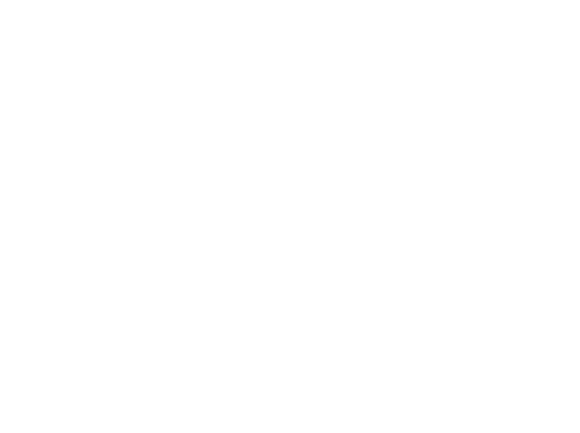

# Netflix cloning  With Next.js
Our project aims to replicate the popular streaming platform `Netflix using Next.js`, a powerful React framework for building web applications. Through our Netflix clone.  
#### Users will be able to :  
1. browse and stream a vast library of movies and TV shows seamlessly. 
2. Leveraging the versatility of Next.js, we'll create an immersive user experience with dynamic content loading, responsive design, and smooth navigation. 
3. With features such as user authentication, search functionality, and personalized recommendations   
`Netflix clone promises to deliver an engaging and enjoyable streaming experience reminiscent of the original platform.`

### 1. DataBase Modeling and Relations between them

